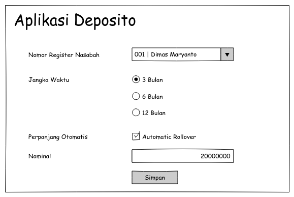
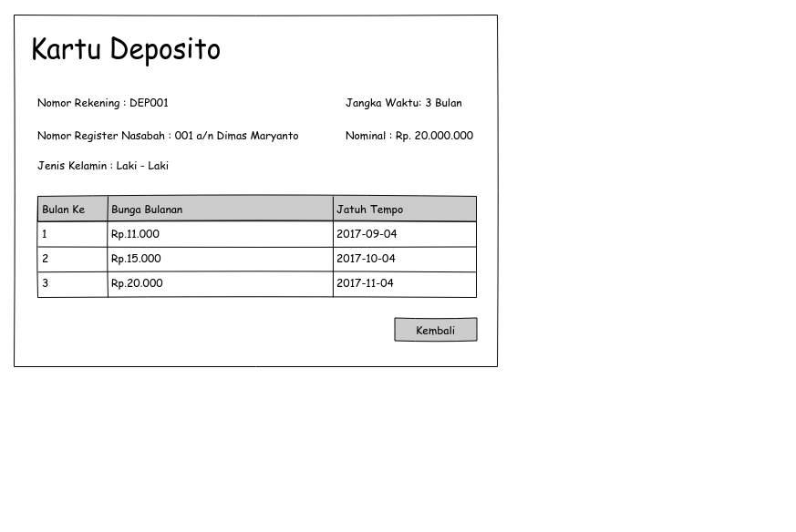

# Bootcamp 2017-1 Java Web

Latihan membuat aplikasi perbankan modul deposito:

1. Buatlah Master Nasabah dengan tampilan seperti berikut:

2. Buatlah aplikasi Deposito yang berelasi dengan nasabah seperti berikut:

jadi ketika menyimpan aplikasi deposito itu sekaligus membuat kartu depositonya dengan perhitungan

bunga bulanan = jumlah hari dalam sebulan * nominal * bunga per tahun / 365

contoh : 

Aplikasi tgl 2017-10-4 jumlah harinya 30, nominal 10jt dan bunga pertahun 10%

jadi bunga harinya adalah `30*10000000*0.1/365` jadi `Rp. 82,192.00`